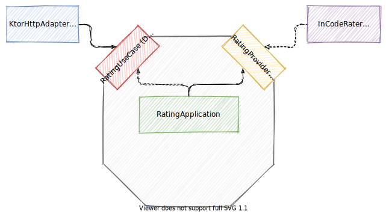

# Ports and Adapters Examples

This is an example application using the Ports and Adapters (a.k.a. Hexagonal
Architecture) architecture pattern. It is inspired by the
[SmallerWebHexagon](https://github.com/totheralistair/SmallerWebHexagon)
example application that is linked to in the [original Hexagonal Architecture
blog post](https://alistair.cockburn.us/hexagonal-architecture/).

<p align="center">
 
</p>

## Running the application

```sh
$ ./gradlew run
```

## Running the tests

```sh
$ ./gradlew test
```
