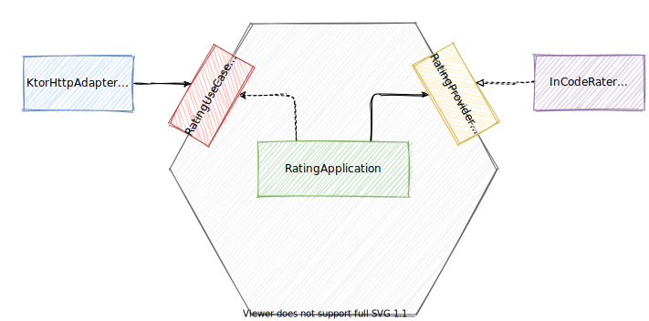

# A Color Coded Guide to Ports and Adapters

This is an example application that is referenced
in [A Color Coded Guide to Ports and Adapters](https://8thlight.com/blog/damon-kelley/2021/05/18/a-color-coded-guide-to-ports-and-adapters.html).

This application uses the Ports and Adapters (a.k.a. Hexagonal
Architecture) architecture pattern, and it is inspired by the
[SmallerWebHexagon](https://github.com/totheralistair/SmallerWebHexagon)
example application that is linked to in the [original Hexagonal Architecture
blog post](https://alistair.cockburn.us/hexagonal-architecture/).

<p align="center">
 
</p>

## Running the application

```sh
$ ./gradlew aCCG:run
```

## Running the tests

```sh
$ ./gradlew aCCG:test
```
